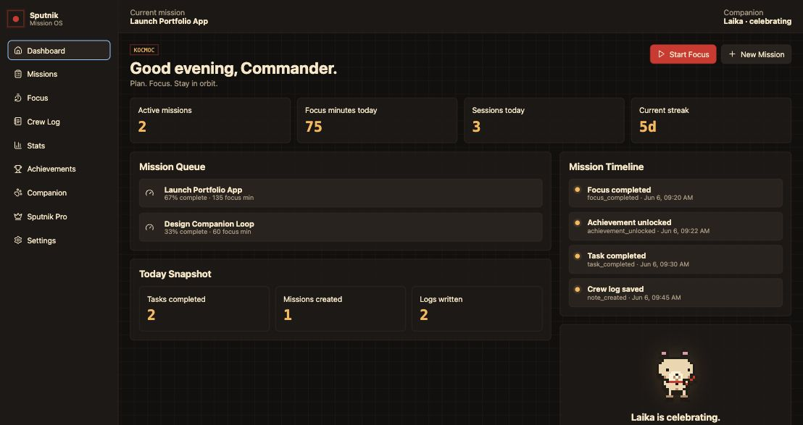
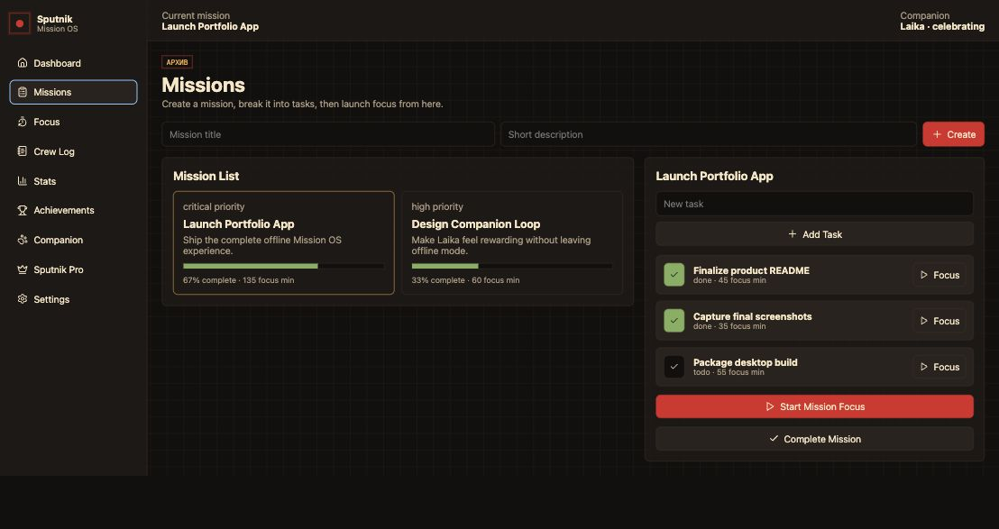
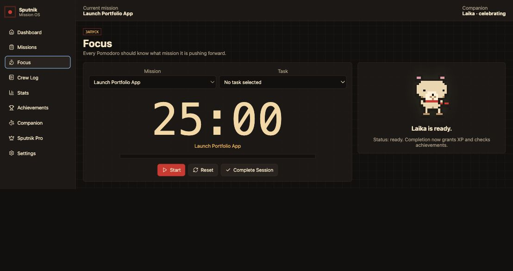
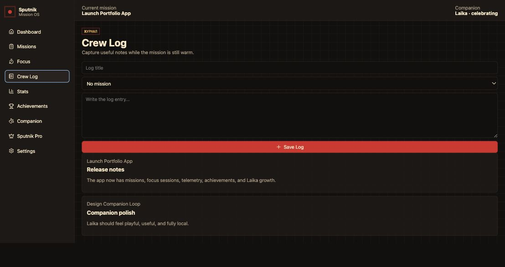
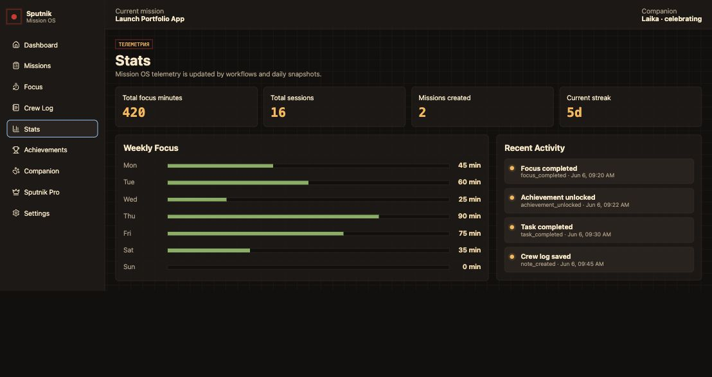
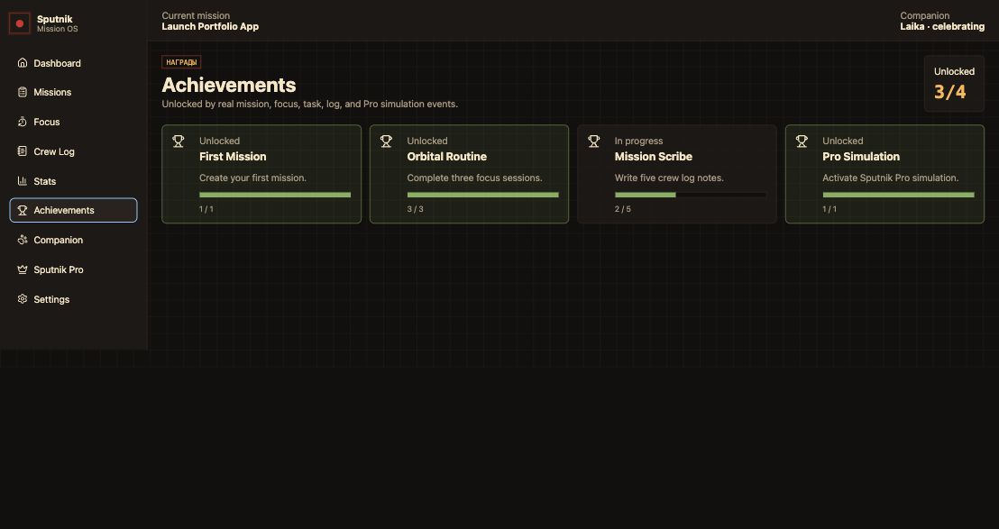
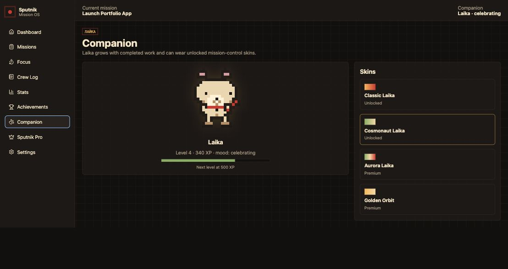
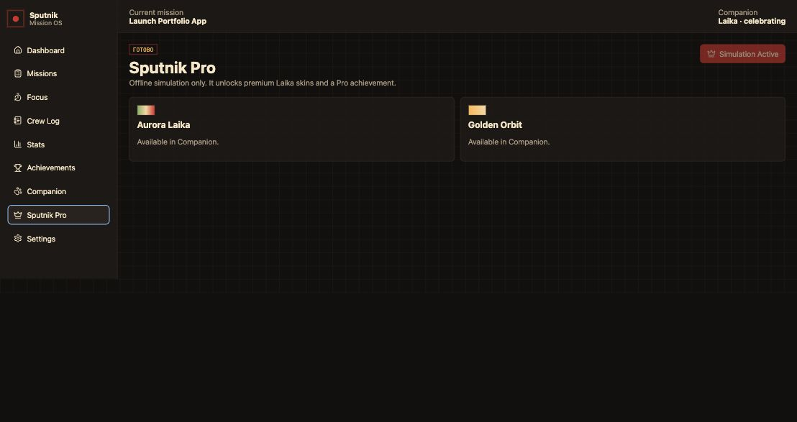

# Sputnik

<p align="center">
  
</p>

<p align="center">
  <strong>An offline desktop mission-control app for planning work, staying focused, and tracking progress locally.</strong>
</p>

<p align="center">
  
  
  
  
</p>

Sputnik is a cozy mission-control productivity app for people who want a local, focused workspace instead of another cloud dashboard. It combines missions, tasks, focus sessions, notes, stats, achievements, and a small companion system into a single desktop app.

The app is designed around a simple loop:

```txt
Plan a mission -> Add tasks -> Focus -> Log notes -> Review stats -> Unlock rewards
```

## Product Flow

### 1. Start From The Dashboard

<p align="center">
  
</p>

The dashboard gives you a quick command-center view of your workspace. It shows the current mission, active mission count, focus minutes, completed sessions, recent activity, progress signals, and Laika's current mood.

Use it to answer: What am I working on, how much progress did I make today, and what should I do next?

### 2. Create Missions And Tasks

<p align="center">
  
</p>

Missions are larger goals. Tasks are the smaller steps inside each mission. Sputnik lets you create missions, add tasks, mark tasks complete, launch focus from a mission, and see progress update from real local actions.

This keeps planning close to execution: you do not just write down work, you connect it to focus time.

### 3. Run Focus Sessions

<p align="center">
  
</p>

The focus screen connects a Pomodoro-style session to the selected mission and optional task. Completing a session stores the focus minutes locally, updates mission progress, contributes to stats, and rewards companion progress.

The timer is intentionally large and calm so the app can stay open beside your work.

### 4. Keep A Crew Log

<p align="center">
  
</p>

Crew Log is a lightweight notes area for capturing context while the work is still fresh. Notes can be connected to missions so planning, progress, and reflections stay together.

Use it for decisions, blockers, end-of-session notes, or quick project logs.

### 5. Review Stats And Telemetry

<p align="center">
  
</p>

Stats turns completed work into a readable activity picture. It shows total focus minutes, completed sessions, mission count, streaks, weekly focus bars, daily snapshots, and recent Mission OS activity.

Use it to review momentum and understand how your planning habits are changing over time.

### 6. Unlock Achievements

<p align="center">
  
</p>

Achievements reward real local actions: creating missions, finishing focus sessions, writing logs, completing tasks, and activating the local Pro simulation. Progress is visible even before an achievement is fully unlocked.

### 7. Grow Laika

<p align="center">
  
</p>

Laika is Sputnik's companion system. Completed work grants XP, increases levels, changes mood, and unlocks or equips different skins. The companion screen shows current XP, level progress, mood, and available skins.

### 8. Try Sputnik Pro Simulation

<p align="center">
  
</p>

Sputnik Pro is a local-only simulation. It does not process payments or connect to a real billing service. In the app, it demonstrates how premium companion skins and a Pro achievement could unlock while staying fully offline.

## What Sputnik Includes

| Area | Description |
| --- | --- |
| Missions | Create goals, track progress, complete missions, and accumulate focus minutes |
| Tasks | Break missions into concrete work items and complete them from the mission flow |
| Focus | Run mission-aware focus sessions and save completed work locally |
| Crew Log | Write local notes connected to the work you are doing |
| Stats | Review focus totals, weekly activity, streaks, snapshots, and recent activity |
| Companion | Laika gains XP, levels up, changes mood, and supports unlockable skins |
| Achievements | Unlock rewards through real app activity |
| Pro Simulation | Local-only premium simulation that unlocks additional companion skins |
| Offline Storage | All app data is stored locally with SQLite |

## Download And Run

Clone the repository:

```bash
git clone https://github.com/Yamabiko101/Sputnik.git
cd Sputnik
```

Install dependencies:

```bash
npm install
```

Run the desktop app:

```bash
npm run dev
```

If you downloaded the project as a ZIP from GitHub, unzip it, open a terminal inside the extracted `Sputnik` folder, then run:

```bash
npm install
npm run dev
```

## Commands

| Command | Purpose |
| --- | --- |
| `npm install` | Install dependencies and rebuild native modules |
| `npm run dev` | Start the Electron app in development mode |
| `npm run build` | Create a production build |
| `npm run preview` | Preview the built Electron app |
| `npm run rebuild` | Rebuild `better-sqlite3` manually |

## How The App Works

Sputnik is an Electron desktop app with a React renderer and a SQLite-backed main process.

```txt
React renderer -> preload window.sputnik -> IPC -> services/workflows -> repositories -> SQLite
```

The renderer does not access SQLite directly. Desktop and database capabilities stay in the Electron main process, while the renderer talks through a preload API exposed as `window.sputnik`.

## Local Data

Sputnik stores data under Electron's `userData` directory in a local `sputnik/sputnik.sqlite` database.

Ignored local files include:

- `node_modules/`
- `out/`
- `dist/`
- SQLite database files

## Tech Stack

| Layer | Tools |
| --- | --- |
| Desktop shell | Electron |
| Build tooling | electron-vite, Vite |
| Interface | React, lucide-react |
| Storage | SQLite, better-sqlite3 |

## Verification

The current project has been checked with:

```bash
npm run build
npm audit
npm run preview
```

There are no dedicated `test`, `lint`, or `typecheck` scripts in `package.json` yet.

## Notes

- Sputnik is local and offline-first.
- Recommended minimum useful window size is around `900x620`.
- The Pro flow is a local simulation; there are no real payments.
- Future packaging work can add installers and app distribution artifacts.
