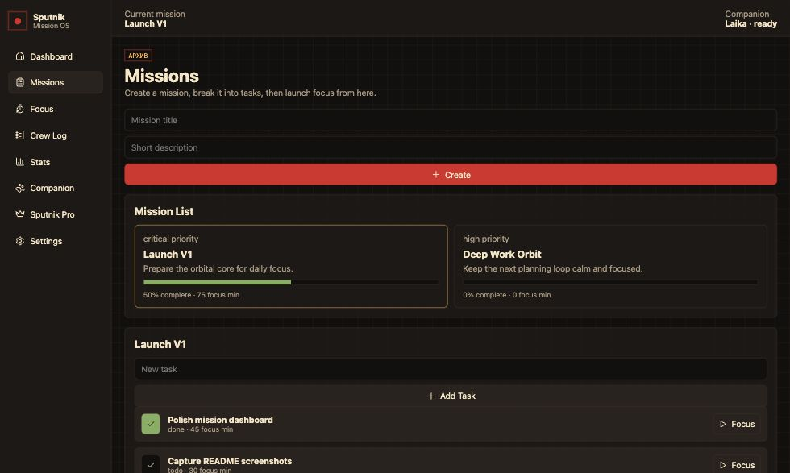
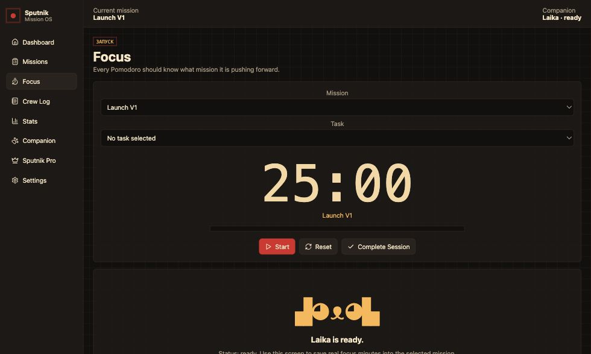
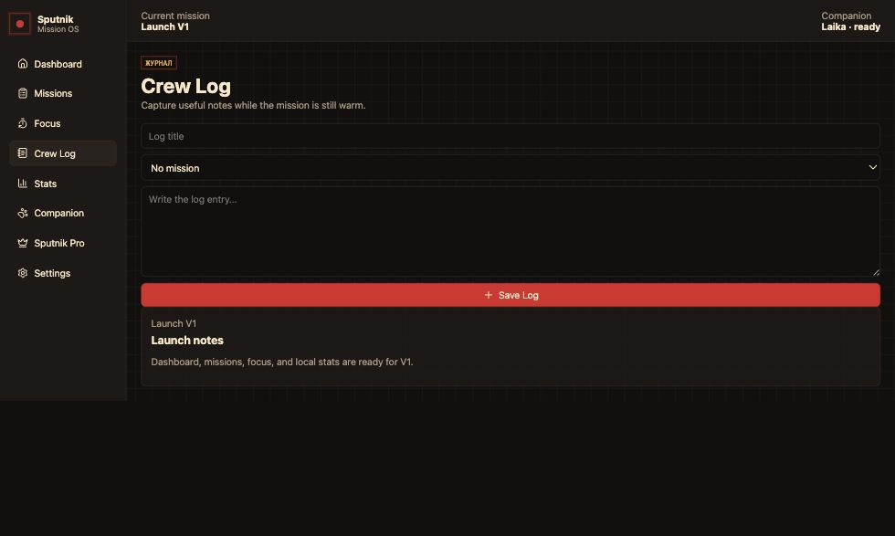

# Sputnik

<p align="center">
  
</p>

<p align="center">
  <strong>A cozy offline mission-control desktop app for planning, focus, and local progress tracking.</strong>
</p>

<p align="center">
  
  
  
  
</p>

Sputnik turns work into missions. V3 gives you a calm desktop cockpit for creating missions, breaking them into tasks, completing focus sessions, writing crew log notes, tracking Mission OS telemetry, unlocking achievements, and growing Laika through local progress.

## See It

<p align="center">
  
</p>

<p align="center">
  <strong>Dashboard</strong> · mission status, focus totals, daily sessions, and companion mood
</p>

<table>
  <tr>
    <td width="50%">
      
      <p align="center"><strong>Missions</strong></p>
    </td>
    <td width="50%">
      
      <p align="center"><strong>Focus</strong></p>
    </td>
  </tr>
  <tr>
    <td width="50%">
      
      <p align="center"><strong>Crew Log</strong></p>
    </td>
    <td width="50%">
      <br>
      <h3>V3 Feeling</h3>
      <p>Retro mission control, warm colors, local data, timeline telemetry, achievements, and Laika companion growth.</p>
      <p><strong>Mission -> Tasks -> Focus -> Progress -> Crew Log -> Rewards</strong></p>
    </td>
  </tr>
</table>

## V3 Highlights

| Area | What It Does |
| --- | --- |
| Missions | Create missions, view progress, and track focus minutes |
| Tasks | Add tasks, complete tasks, and connect tasks to focus sessions |
| Focus | Run a mission-aware timer and save completed sessions |
| Crew Log | Keep local notes tied to mission context |
| Stats | Daily snapshots, weekly focus, current streak, and Mission OS activity |
| Companion | Laika gains XP, levels up, reacts to progress, and supports skins |
| Achievements | Unlock rewards from real local actions |
| Pro | Local simulation only, unlocking premium Laika skins |

## Download And Run

Clone the repository:

```bash
git clone https://github.com/Yamabiko101/Sputnik.git
cd Sputnik
```

Install dependencies:

```bash
npm install
```

Run the desktop app:

```bash
npm run dev
```

If you downloaded a ZIP from GitHub, unzip it, open a terminal inside the extracted `Sputnik` folder, then run:

```bash
npm install
npm run dev
```

## Commands

| Command | Purpose |
| --- | --- |
| `npm install` | Install dependencies and rebuild native modules |
| `npm run dev` | Start the Electron app in development mode |
| `npm run build` | Create a production build |
| `npm run preview` | Preview the built Electron app |
| `npm run rebuild` | Rebuild `better-sqlite3` manually |

## Version Architecture

Sputnik was built in three versions so each layer stays understandable.

| Version | Name | Direction |
| --- | --- | --- |
| V1 | Orbital Core | Missions, tasks, focus, notes, stats, local SQLite |
| V2 | Mission OS | Activity ledger, daily snapshots, transactional workflows, streaks |
| V3 | Laika and Product Feel | XP, levels, skins, achievements, Pro simulation, keyboard shortcuts |

## V3 Smoke Flow

Use this flow after running the app:

1. Open the dashboard.
2. Create a mission.
3. Add tasks to the mission.
4. Select a mission and task in Focus.
5. Complete a focus session.
6. Confirm focus minutes, timeline, stats, Laika XP, and achievements update.
7. Write a Crew Log note.
8. Open Companion and switch an unlocked skin.
9. Activate Sputnik Pro simulation and confirm premium skins unlock.

## Architecture

Sputnik keeps desktop-only capabilities out of the renderer:

```txt
React renderer -> preload window.sputnik -> IPC -> services/workflows -> repositories -> SQLite
```

SQLite and Electron APIs live in the main process. The renderer uses the preload API exposed as `window.sputnik`.

## Local Data

Sputnik stores data under Electron's `userData` directory in a local `sputnik/sputnik.sqlite` database.

Ignored local files include:

- `node_modules/`
- `out/`
- `dist/`
- SQLite database files

## Tech Stack

| Layer | Tools |
| --- | --- |
| Desktop shell | Electron |
| Build tooling | electron-vite, Vite |
| Interface | React, lucide-react |
| Storage | SQLite with better-sqlite3 |

## QA

Current V3 verification:

```bash
npm run build
npm audit
npm run preview
```

There are no dedicated `test`, `lint`, or `typecheck` scripts in `package.json` yet.

## V3 Notes

- Sputnik is currently local and offline.
- Recommended minimum useful window size is around `900x620`.
- The Pro flow is only a local simulation; there are no real payments.
- Future versions should add automated checks before release.
