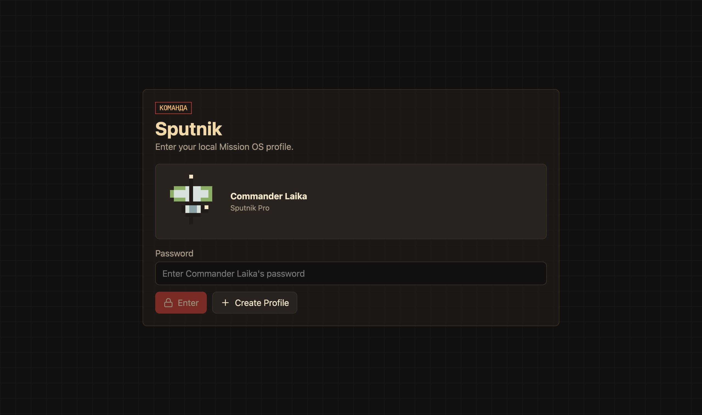
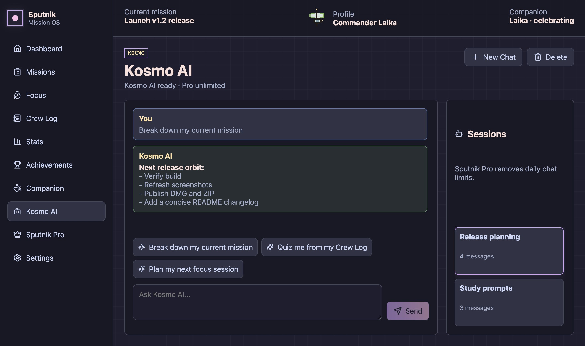
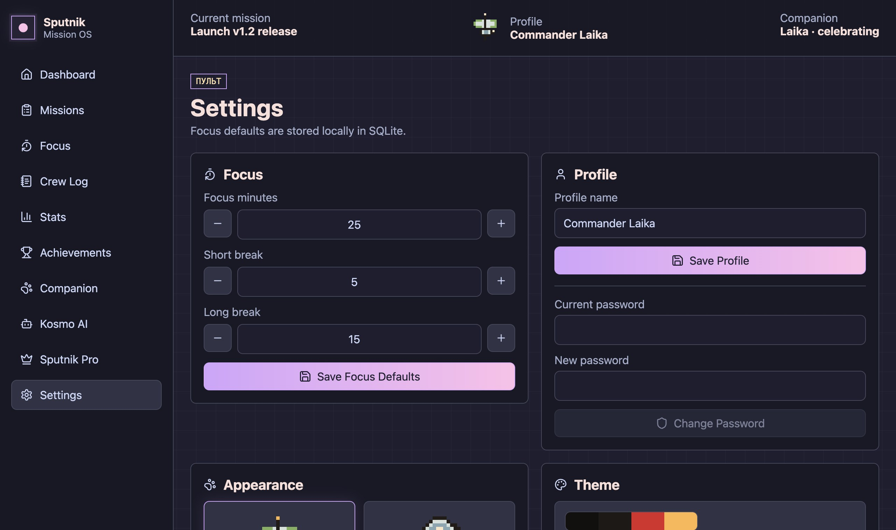

# Sputnik

<p align="center">
  
</p>

<p align="center">
  <strong>An offline desktop mission-control app for planning work, staying focused, and tracking progress locally.</strong>
</p>

<p align="center">
  
  
  
  
  
  
</p>

Sputnik is a cozy mission-control productivity app for people who want a local, focused workspace instead of another cloud dashboard. It combines local profiles, missions, tasks, focus sessions, notes, stats, achievements, themes, Kosmo AI, settings, and a small companion system into a single desktop app.

The app is designed around a simple loop:

```txt
Log in -> Plan a mission -> Ask Kosmo -> Focus -> Log notes -> Review stats -> Unlock rewards
```

<p align="center">
  
</p>

## Current Release

Sputnik `1.2.0` is the current macOS desktop release. This version refreshes the visual system, adds Catppuccin and Gruvbox theme families, improves Crew Log validation, tightens dashboard activity, and ships new macOS installer assets.

## What's New

| Update | Description |
| --- | --- |
| Local profiles | Create password-protected profiles and keep each workspace separate |
| Profile login | Return to saved local profiles without mixing mission data |
| Profile settings | Rename profiles, change passwords, log out, or delete a profile with confirmation |
| Pixel avatars | Choose animated profile avatars, with a Pro avatar unlocked by the local Pro simulation |
| Kosmo AI | Optional Gemini-powered mission coach with local chat sessions and Sputnik context |
| Visual themes | Switch between Orbital Core, Catppuccin, Gruvbox, and Gruvbox Light themes |
| Dashboard timeline | Recent activity stays compact, with a quick toggle for older events |
| Crew Log validation | Empty log titles are blocked before save and shown with friendlier guidance |
| Laika polish | Companion animation is calmer on idle surfaces and more expressive while focusing or celebrating |
| Kosmo settings | API key status is easier to scan from the Settings panel |
| Fresh screenshots | GitHub documentation images were regenerated from the current renderer |
| Separate local databases | Each profile stores its own missions, tasks, notes, stats, achievements, and companion state |
| Better activity tracking | Mission, task, and Crew Log edits/deletions now create activity events |
| Safer timer settings | Focus and break duration settings are validated before saving |
| macOS installer | Download the `1.2.0` `.dmg` or `.zip`, drag Sputnik into Applications, and run it locally |

## Visual Tour

<table>
  <tr>
    <td width="50%">
      
      <strong>Local profile gate</strong><br>
      <sub>Create a password-protected workspace before entering Mission OS.</sub>
    </td>
    <td width="50%">
      
      <strong>Mission dashboard</strong><br>
      <sub>See active missions, focus totals, streaks, and the activity timeline.</sub>
    </td>
  </tr>
  <tr>
    <td width="50%">
      
      <strong>Missions and tasks</strong><br>
      <sub>Break goals into clear tasks and connect them to focus sessions.</sub>
    </td>
    <td width="50%">
      
      <strong>Kosmo AI</strong><br>
      <sub>Ask for mission breakdowns, study prompts, and next-step planning.</sub>
    </td>
  </tr>
  <tr>
    <td width="50%">
      
      <strong>Laika companion</strong><br>
      <sub>Earn XP, unlock moods, and equip visual rewards through real progress.</sub>
    </td>
    <td width="50%">
      
      <strong>Profile and settings</strong><br>
      <sub>Tune timers, manage your profile, save a local API key, and choose themes.</sub>
    </td>
  </tr>
</table>

## Product Flow

### 1. Create Or Open A Profile

<p align="center">
  
</p>

Sputnik starts with a local profile gate. Create a profile with a name and password, or log back into an existing profile. Profiles are stored locally and keep their workspaces separate.

### 2. Start From The Dashboard

<p align="center">
  
</p>

The dashboard gives you a quick command-center view of your workspace. It shows the current mission, active mission count, focus minutes, completed sessions, recent activity, progress signals, and Laika's current mood.

Use it to answer: What am I working on, how much progress did I make today, and what should I do next?

### 3. Create Missions And Tasks

<p align="center">
  
</p>

Missions are larger goals. Tasks are the smaller steps inside each mission. Sputnik lets you create missions, add tasks, mark tasks complete, launch focus from a mission, and see progress update from real local actions.

This keeps planning close to execution: you do not just write down work, you connect it to focus time.

### 4. Run Focus Sessions

<p align="center">
  
</p>

The focus screen connects a Pomodoro-style session to the selected mission and optional task. Completing a session stores the focus minutes locally, updates mission progress, contributes to stats, and rewards companion progress.

The timer is intentionally large and calm so the app can stay open beside your work.

### 5. Keep A Crew Log

<p align="center">
  
</p>

Crew Log is a lightweight notes area for capturing context while the work is still fresh. Notes can be connected to missions so planning, progress, and reflections stay together.

Use it for decisions, blockers, end-of-session notes, or quick project logs.

### 6. Review Stats And Telemetry

<p align="center">
  
</p>

Stats turns completed work into a readable activity picture. It shows total focus minutes, completed sessions, mission count, streaks, weekly focus bars, daily snapshots, and recent Mission OS activity.

Use it to review momentum and understand how your planning habits are changing over time.

### 7. Unlock Achievements

<p align="center">
  
</p>

Achievements reward real local actions: creating missions, finishing focus sessions, writing logs, completing tasks, and activating the local Pro simulation. Progress is visible even before an achievement is fully unlocked.

### 8. Grow Laika

<p align="center">
  
</p>

Laika is Sputnik's companion system. Completed work grants XP, increases levels, changes mood, and unlocks or equips different skins. The companion screen shows current XP, level progress, mood, and available skins.

### 9. Ask Kosmo AI

<p align="center">
  
</p>

Kosmo AI is an optional mission coach powered by Gemini. It can use your local Sputnik context to help break down missions, plan focus sessions, quiz Crew Log notes, and explain ideas step by step. Chat sessions are stored locally, and the API key can be saved securely from Settings when available.

### 10. Try Sputnik Pro Simulation

<p align="center">
  
</p>

Sputnik Pro is a local-only simulation. It does not process payments or connect to a real billing service. In the app, it demonstrates how premium companion skins, premium themes, unlimited Kosmo AI usage, and a Pro achievement could unlock.

### 11. Manage Settings, Themes, And Profile

<p align="center">
  
</p>

Settings lets you tune focus, short break, and long break durations. It also lets you rename the active profile, change the local password, log out, delete the profile, choose available pixel avatars, switch themes, and configure the optional Kosmo AI API key.

## What Sputnik Includes

| Area | Description |
| --- | --- |
| Local Profiles | Create password-protected local profiles with separate data stores |
| Missions | Create goals, track progress, complete missions, and accumulate focus minutes |
| Tasks | Break missions into concrete work items and complete them from the mission flow |
| Focus | Run mission-aware focus sessions and save completed work locally |
| Crew Log | Write local notes connected to the work you are doing |
| Stats | Review focus totals, weekly activity, streaks, snapshots, and recent activity |
| Companion | Laika gains XP, levels up, changes mood, and supports unlockable skins |
| Achievements | Unlock rewards through real app activity |
| Kosmo AI | Optional Gemini-powered mentor with local chat history and daily Free usage limits |
| Themes | Orbital Core, Catppuccin, Gruvbox, and Gruvbox Light visual modes |
| Settings | Tune focus timers, configure Kosmo AI, and manage the active local profile |
| Pro Simulation | Local-only premium simulation that unlocks additional companion skins, themes, and unlimited Kosmo AI |
| Offline Storage | All app data is stored locally with SQLite |

## Download And Install

The easiest way to use Sputnik is to download the latest installer from GitHub. The `1.2.0` release provides macOS arm64 `.dmg` and `.zip` builds:

<p align="center">
  <a href="https://github.com/Yamabiko101/Sputnik/releases/latest">
    
  </a>
</p>

1. Open the [latest Sputnik release](https://github.com/Yamabiko101/Sputnik/releases/latest).
2. Download the `.dmg` file.
3. Open the `.dmg`.
4. Drag `Sputnik` into `Applications`.
5. Launch Sputnik from `Applications`.

On the first launch, macOS may ask for confirmation because the app is distributed directly from GitHub. If that happens, right-click `Sputnik`, choose `Open`, then confirm once.

The `.zip` file is also available for people who prefer opening the app directly without the installer window.

## Run From Source

Clone the repository:

```bash
git clone https://github.com/Yamabiko101/Sputnik.git
cd Sputnik
```

Install dependencies:

```bash
npm install
```

Run the desktop app:

```bash
npm run dev
```

If you downloaded the project as a ZIP from GitHub, unzip it, open a terminal inside the extracted `Sputnik` folder, then run:

```bash
npm install
npm run dev
```

## Optional Kosmo AI Setup

Kosmo AI is optional. The rest of Sputnik works fully offline without an API key.

To enable Kosmo AI, either:

- Open Sputnik Settings and save a Gemini API key in the Kosmo AI panel.
- Or set `GEMINI_API_KEY` in your local shell before launching the app.

Saved keys use Electron secure storage when it is available on the device. `.env.local` is ignored by git.

## Commands

| Command | Purpose |
| --- | --- |
| `npm install` | Install dependencies and rebuild native modules |
| `npm run dev` | Start the Electron app in development mode |
| `npm run build` | Create a production build |
| `npm run dist:mac` | Create macOS `.dmg` and `.zip` installers in `release/` |
| `npm run preview` | Preview the built Electron app |
| `npm run rebuild` | Rebuild `better-sqlite3` manually |

## How The App Works

Sputnik is an Electron desktop app with a React renderer and a SQLite-backed main process.

```txt
React renderer -> preload window.sputnik -> IPC -> services/workflows -> repositories -> SQLite
```

The renderer does not access SQLite directly. Desktop and database capabilities stay in the Electron main process, while the renderer talks through a preload API exposed as `window.sputnik`.

## Local Data

Sputnik stores data under Electron's `userData` directory. Account records live in a local `sputnik/accounts.sqlite` database, and each profile gets its own `sputnik/profiles/<profile-id>/sputnik.sqlite` workspace database. Kosmo AI chat sessions and usage metadata are stored in the active profile database.

Ignored local files include:

- `node_modules/`
- `out/`
- `dist/`
- `release/`
- `.env.local`
- SQLite database files

## Tech Stack

| Layer | Tools |
| --- | --- |
| Desktop shell | Electron |
| Build tooling | electron-vite, Vite |
| Interface | React, lucide-react |
| Storage | SQLite, better-sqlite3 |

## Verification

The current project has been checked with:

```bash
npm run build
npm run dist:mac
```

There are no dedicated `test`, `lint`, or `typecheck` scripts in `package.json` yet.

## Notes

- Sputnik is local and offline-first.
- Recommended minimum useful window size is around `900x620`.
- The Pro flow is a local simulation; there are no real payments.
- macOS may ask for first-launch confirmation because the release is distributed directly from GitHub.
